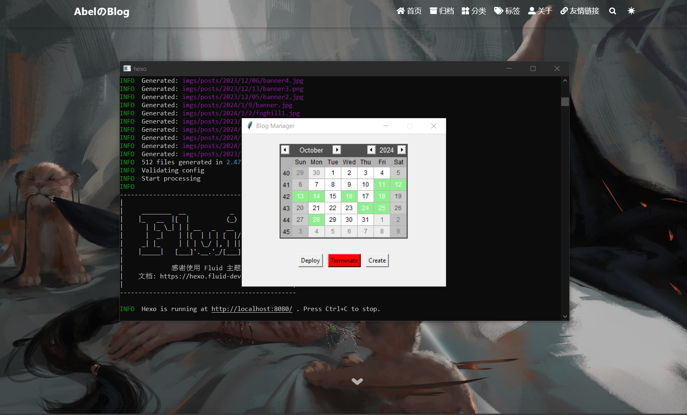

# BlogManager

Graphical interface(GUI) based on hexo's fluid theme. This is a project for facilitate myself blog manager which based on [hexo’s fluid theme](https://github.com/fluid-dev/hexo-theme-fluid). [This is my blog](https://chen-huaneng.github.io/).

## ✨Features

- 💪Deploy blog to website
- 📁Create blog folder and `.md` file in local computer
- 💻 Preview blog in local computer
- 📋Check which dates blogs were written on
- 📦Manage and open blog post folders based on date
- ⏳Non-blocking GUI
- 🚀Compact and portable
- 🛠️ No need to manually manage and open folder and article file
- 📈And more…

## ⚡️ Requirements

- Python >= 3.13.0

- Python package:
  Package                   Version

  ------------------------- --------
  altgraph                  0.17.4
  babel                     2.16.0
  packaging                 24.1
  pefile                    2023.2.7
  pip                       24.2
  pyinstaller               6.11.0
  pyinstaller-hooks-contrib 2024.9
  pywin32-ctypes            0.2.3
  setuptools                75.1.0
  tkcalendar                1.6.1
  wheel                     0.44.0

## 🚀 Getting Started

Check the releases.
